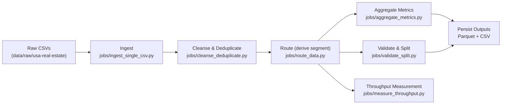

## Scalable Data Processing Pipeline — Spark POC

A practical, incremental Spark pipeline you can run locally first, then scale up. We start simple (ingest one CSV ~100k rows), then add cleansing, routing, aggregations, validation, throughput measurement, and persistence. (Enrichment step is currently skipped.)

### Architecture (Pipeline Overview)


### Pipeline stages
- **Ingest one CSV (local)**: quick validation of schema, sample, and counts
- **Cleanse & Deduplicate**: remove duplicates using Spark joins/keys
- **Route Data**: add a derived column based on decision rules
// Enrich step intentionally skipped in this POC iteration
- **Aggregate**: groupBy with sum/min/max
- **Validate & Split**: separate invalid records
- **Measure Throughput**: compare records/sec on small vs large datasets
- **Persist Output**: write results as CSV + Parquet

We will keep this README up to date as each stage is added.

---

### Repo structure (key paths)
- `jobs/` — Spark jobs/scripts
  - `jobs/ingest_single_csv.py` — Step 1: read a single CSV, print schema/count/sample
- `data/` — local data (not committed)
  - `data/raw/usa-real-estate/` — place your input CSV(s) here
  - `data/processed/` — outputs for later steps

Note: The project path on this machine contains a space. Wrap paths in quotes when using the shell.

Project root (example):
```
"/Users/edwardjr/Downloads/upwork /Engineering/Scalable-Data-Processing-Pipeline-Spark-POC-"
```

---

### Prerequisites
- Python 3.9+
- Java/JRE installed (required by Spark)
- Install PySpark:
```bash
pip3 install pyspark
```

#### Reproducible setup (Docker + Make)
```bash
# Build and run default ingestion job
make docker-build
make docker-run

# Or run locally
make setup
make run-ingest
make run-dedupe
make run-route
make run-aggregate
make run-validate
make run-throughput
```

Optional — Kaggle CLI (for programmatic downloads later):
```bash
pip3 install kaggle
# Place API token at ~/.kaggle/kaggle.json and run: chmod 600 ~/.kaggle/kaggle.json
```

---

### Data placement
Put your CSV file(s) here so scripts can auto-discover them:
```
data/raw/usa-real-estate/
```
Alternatively, you can pass an explicit `--input` path to any script.

---

### Step 1 — Ingest a single CSV (local)
Reads one CSV, optionally limits to ~100k rows, then prints schema, row count, and a small sample.

From the project root:
```bash
python3 "jobs/ingest_single_csv.py" --take 100000
# or specify a file explicitly
python3 "jobs/ingest_single_csv.py" --input "/absolute/path/to/file.csv" --take 100000
```

Notes:
- The script prints the schema because it calls `printSchema()`.
- `inferSchema` controls types: by default it infers data types; add `--no-infer-schema` to read all columns as strings.

---

### Step 2 — Cleanse & Deduplicate (JOIN-based)
Cleans string columns (trim) and removes duplicates using a join-based method on provided key columns.

From the project root:
```bash
# Example with two key columns and write outputs to data/processed/cleanse_dedup
python3 "jobs/cleanse_deduplicate.py" --keys parcel_number,address --take 100000 --write-output

# Use explicit input glob and skip trimming
python3 "jobs/cleanse_deduplicate.py" --input "data/raw/usa-real-estate/*.csv" --keys parcel_number --no-trim
 
# Example using the POC keys: street, city, state, zip_code, with normalization
python3 "jobs/cleanse_deduplicate.py" \
  --keys street,city,state,zip_code \
  --lowercase --normalize-spaces --strip-punct \
  --take 100000 --write-output
```

Options:
- `--keys`: comma-separated key columns used to identify duplicates (required)
- `--take`: limit for quick local runs (default 100k; set `-1` for all)
- `--no-trim`: disable trimming of string columns
- `--no-infer-schema` / `--no-header`: CSV read options
- `--write-output`: write deduped data to `data/processed/cleanse_dedup/{parquet,csv}`
- `--coalesce`: coalesce partitions before write (default 1)

Keys used in this POC (example):
- We use `street, city, state, zip_code` as the deduplication keys for demonstration.
- Adjust if your dataset uses different column names (e.g., `address` vs `street`, `zip` vs `zip_code`).

How dedup works:
- Adds a synthetic `__row_id` per row
- Groups by the key columns and takes the minimal `__row_id` per group
- Joins back on keys + `__row_id` to keep exactly one row per group

---

### Step 3 — Route Data (derive segment)
Adds a `segment` column based on simple rules.

Default rules (preset_basic):
- price > 1,000,000 → segment = luxury
- else if beds ≥ 3 and sqft ≥ 2000 → segment = family
- else → segment = standard

From the project root (uses step 2 parquet by default if present):
```bash
python3 "jobs/route_data.py" --rules preset_basic --take 100000 --write-output
# Or point explicitly to step 2 output or raw CSVs
python3 "jobs/route_data.py" --input "data/processed/cleanse_dedup/parquet" --rules preset_basic --write-output
python3 "jobs/route_data.py" --input "data/raw/usa-real-estate/*.csv" --rules preset_basic --write-output
```
Outputs:
- `data/processed/routed/parquet/`
- `data/processed/routed/csv/`

---

### Step 4 — Aggregate metrics (sum/min/max/avg)
Enrichment is skipped. Proceed to aggregations on the routed (or deduped) data.

Examples:
```bash
# Aggregate by segment and state, compute metrics over price and house_size
python3 "jobs/aggregate_metrics.py" \
  --input "data/processed/routed/parquet" \
  --group-by segment,state \
  --metrics price:sum,price:min,price:max,price:avg,house_size:avg \
  --write-output

# If routed not available, point to deduped parquet
python3 "jobs/aggregate_metrics.py" \
  --input "data/processed/cleanse_dedup/parquet" \
  --group-by state \
  --metrics price:sum,price:max \
  --write-output
```

Outputs:
- `data/processed/aggregated/parquet/`
- `data/processed/aggregated/csv/`

---

### Step 5 — Validate & Split
Validate records by rules and split into valid/invalid outputs.

Example:
```bash
python3 "jobs/validate_split.py" \
  --required-cols street,city,state,zip_code,price \
  --min-price 0 --zip-col zip_code --zip-len 5 --zip-numeric \
  --nonneg-cols price,house_size,acre_lot --int-cols bed,bath \
  --take 100000 --write-output
```
Outputs:
- `data/processed/validated/valid/{parquet,csv}`
- `data/processed/validated/invalid/{parquet,csv}` with `validation_errors` and `is_valid` columns

---

### Step 6 — Measure Throughput
Measure records/sec for stages (read → dedup → route → aggregate) across sizes.

Examples:
```bash
python3 "jobs/measure_throughput.py" --sizes 10000,100000 --write-output
python3 "jobs/measure_throughput.py" --keys street,city,state,zip_code --sizes 10000,100000 --write-output
```
Outputs:
- `data/metrics/throughput.csv`
- `data/metrics/throughput.json`

---

### Roadmap (as we implement)
1) Cleanse & Deduplicate
   - Remove duplicate records using Spark joins/keys
2) Route Data
   - Add a derived routing column based on decision rules
3) Enrich Data (skipped for now)
   - (Omitted in this POC iteration)
4) Aggregate metrics
   - `groupBy` selected dimensions; compute `sum/min/max` metrics
5) Validate & Split
   - Flag invalid records and write to a separate output
6) Measure Throughput
   - Compare records/sec across small and larger input sizes
7) Persist Output
   - Write final results to CSV and Parquet (with partitioning options)

---

### Known roadblocks and fixes
- Quoted paths for directories with spaces:
  - The local project path contains a space. Wrap paths in quotes.
  - Example: cd "/Users/edwardjr/Downloads/upwork /Engineering/Scalable-Data-Processing-Pipeline-Spark-POC-"
- Ingestion default path:
  - Fixed to default to `data/raw/usa-real-estate/*.csv`; also supports `--input`.
- Dedup required keys:
  - Provide `--keys col1,col2` (we use `street, city, state, zip_code`) or use `--auto-keys`.
- Text normalization for better matching:
  - Use `--lowercase`, `--normalize-spaces`, `--strip-punct` to standardize strings.
- Routing column name variants:
  - Job coalesces alternatives:
    - price: `price`, `list_price`, `sold_price`
    - beds: `beds`, `bedrooms`, `bed`
    - sqft: `sqft`, `sqft_living`, `living_area`, `house_size`
- Keep large data out of Git:
  - `data/` is in `.gitignore`; put inputs under `data/raw` and outputs under `data/processed`.

---

### Troubleshooting
- If Spark fails to start, confirm Java is installed and on PATH
- If no CSV is found, place files under `data/raw/usa-real-estate/` or provide `--input /absolute/path.csv`
- On macOS, always quote paths that contain spaces
